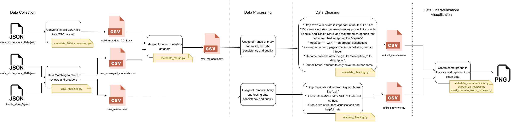
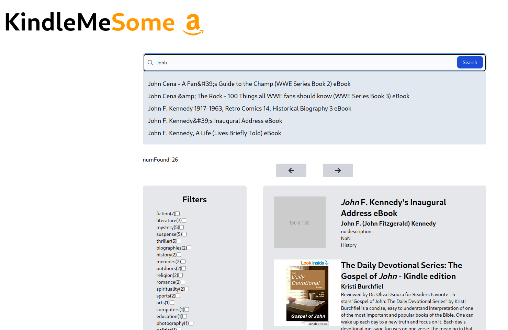

# PRI-T06G02

## Description

**KindleMeSome** is a search engine project designed to process and retrieve book and review information from Amazon's Kindle store. The project leverages the Apache Solr platform to implement a scalable and efficient search engine. The data, sourced from Amazon's Kindle store, includes detailed metadata about books and associated user reviews. The primary focus of the project was to create a system capable of handling complex queries, providing accurate and relevant search results, and evaluating the performance of these queries using standard information retrieval metrics.

Read more about it in the [project report](./Milestone3/docs/Milestone_3__T06G02.pdf) or check the [presentation slides](./Milestone3/docs/G62-report.pdf) for a quick overview.

## Features

- Data Processing and Exploration pipeline. 
- Data visualization and analysis using Python libraries (e.g., Matplotlib, Seaborn).
- Apache Solr schemas for reviews and books.
- Indexing and Querying with Apache Solr specific configurations.
    - Searching for books by specific authors.
    - Filtering books based on content length and topic.
    - Retrieving reviews based on specific sentiments (e.g., positive reviews, vacation reading recommendations). 
- Faceted search for filtering search results.
- Cursor-based pagination for handling large result sets.
- Suggestion for auto-completion of search queries (Fuzzy search).
- Highlighting of search terms in the search results.
- Performance evaluation using standard information retrieval metrics (e.g., Mean Average Precision, Recall, Precision).
- React frontend for user interaction with the search engine.

## Members

| Name   |      Number    | Email | GitHub |
|----------|:-------------:|-------------:|-------------:|
| António Ribeiro |  up201906761 | up201906761@edu.fe.up.pt | [@francisco-rente](https://github.com/francisco-rente) |
| Diogo Maia |  up201904974 | up201904974@edu.fe.up.pt | [@DFMM11](https://github.com/DFMM11) |
| Luís Viegas |  up201904979 | up201904979@edu.fe.up.pt | [@luis-viegas](https://github.com/luis-viegas) |

## Datasets 

Data was gathered from two different datasets: 

- [Kaggle's Amazon Kindle book reviews](https://www.kaggle.com/datasets/bharadwaj6/kindle-reviews)
- [UCSD Amazon review data from 2018 (Kindle Store's metadata section)](http://deepyeti.ucsd.edu/jianmo/amazon/index.html)

> :warning: **Datasets**: The second link that stored the dataset is no longer available. The pipeline stage is not reproducible, and consequently, the final version of the project is not currently available as a full demonstration.

## Images 

### Architecture

### Original Data Exploration pipeline

### Frontend Interface

